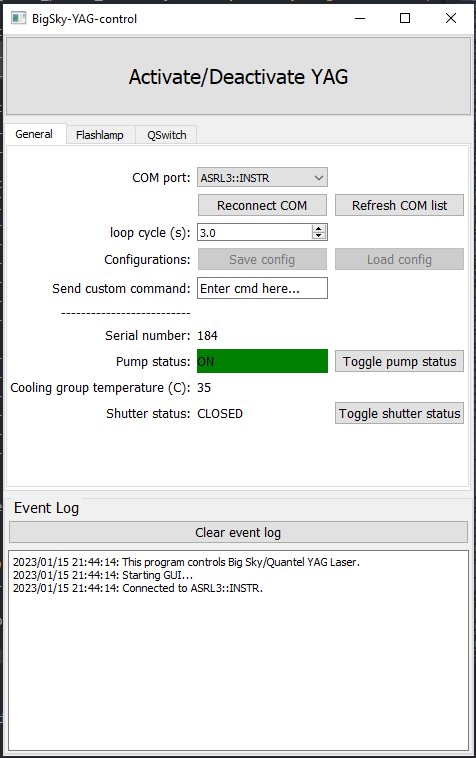

# Big-Sky-YAG
 Python interface for a Big Sky YAG Laser.

## Example
```Python
from big_sky_yag import BigSkyYag

resource_name = "COM4"

yag = BigSkyYag(resource_name = resource_name)

# print the status of the laser
print(yag.laser_status())

# set the flashlamp frequency
yag.flashlamp.frequency = 10 # Hz

# set the flashlamp voltage
yag.flashlamp.voltage = 900 # V

# set the q-switch delay
yag.qswitch.delay = 150 # us

# start the water pump
yag.pump = True

# open the shutter, activate the flashlamp and enable the q-switch
yag.shutter = True
yag.flashlamp.activate()
yag.qswitch.start()

# stop the yag from firing
yag.qswitch.stop()
yag.flashlamp.stop()
```

## Change Firing Mode
The flashlamp and Q-Switch can be triggered either internally, externally, or in case of the Q-switch also in burst mode.
### Flashlamp
* internal trigger 
  ``` Python
  yag.flashlamp.trigger = "internal"
  ```
* external trigger
    ``` Python
  yag.flashlamp.trigger = "external"
  ```

### Q-Switch
* internal
  ```Python
  yag.qswitch.mode = "auto"
  ```
* burst
  ```Python
  yag.qswitch.pulses = 10 # nr. pulses in burst mode
  yag.qswitch.mode = "burst"
  ```
* external
  ```Python
  yag.qswitch.mode = "external"
  ```

## Other commands
* save the current configuration
  ```Python
  yag.save()
  ```
* retrieve the serial number
  ```Python
  yag.serial_number
  ```
* flashlamp counter
  ```Python
  yag.flashlamp.counter
  ```
* flashlamp user counter
  ```Python
  yag.flashlamp.user_counter
  yag.flashlamp.user_counter_reset()
  ```
* q-switch counter
  ```Python
  yag.flashlamp.counter
  ```
* q-switch user counter
  ```Python
  yag.qswitch.counter_user
  yag.qswitch.counter_user()
  ```
* nr. pulses to wait before starting the q-switch
  ```Python
  yag.qswitch.pulses_wait
  ```
* single q-switch shot
  ```Python
  yag.qswitch.single()
  ```

  ## Graphical user interface
  
